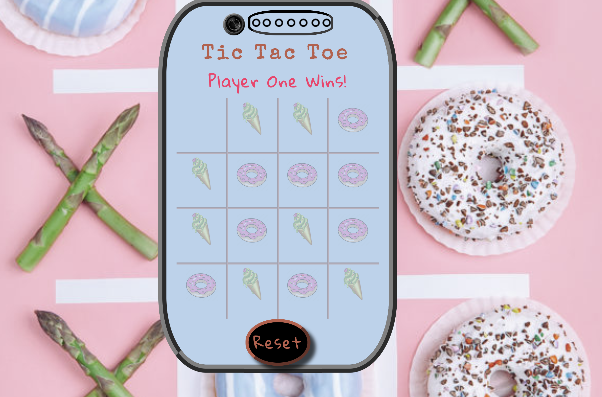
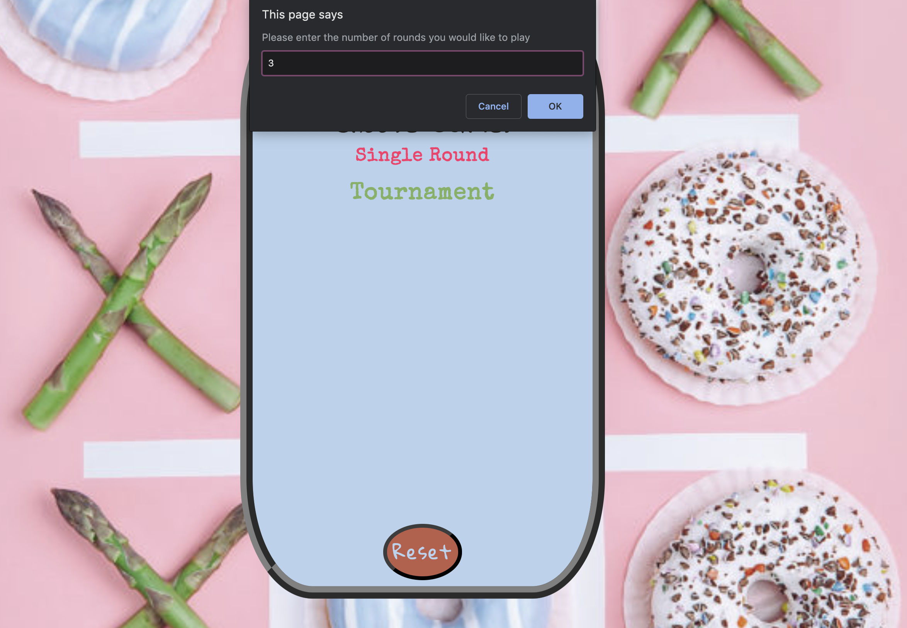
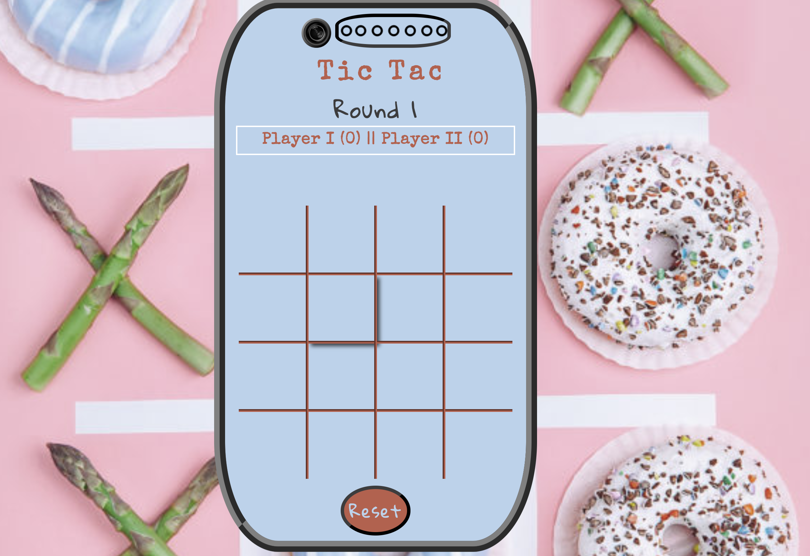
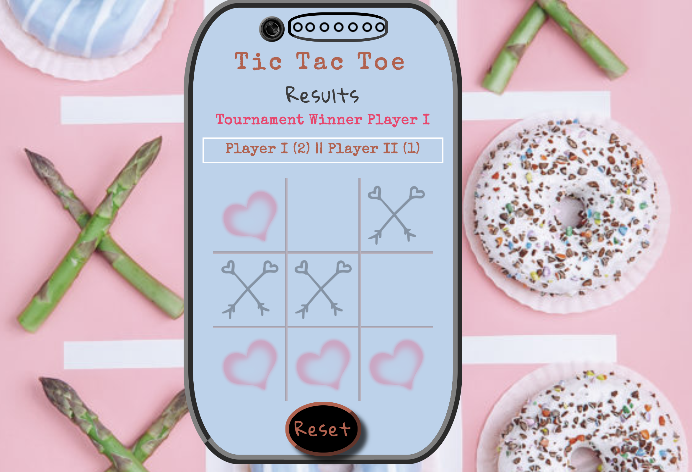

# Project 0

TIC TAC TOE
--------------------------------------


Tic Tac Toe is a simple yet fun game to be played between two players.

This game is the modern day ***Tic Tac Toe***. It has got *fancy* icons to juggle with.

[Play the traditional Paper Pencil Game in an absolutely attractive new way!](http://w3c.org/)

## Game Format

There are two levels in the game *Easy* & *Hard*.

### Easy Cheesy ~ 3X3 Board


### Hard Art ~ 4X4 Board


---------------------------------------
Next Step
----------------------------------------

Each of the Levels have two ***Types*** of *Game Rounds*:
1. Single Round
1. Tournament

On **Single Round** selection, one round of game can be played between the two players and the Results will be displayed right after the game is over.



On **Tournament** selection, the players will be asked through a ***PROMPT Message*** how many rounds would they like to play with each other.



Accordingly, a tabular format of score will be displayed throughout the tournament for the players to track their scores.



Once all the rounds are played the *Tournament Winner* will be disclosed



I gave my Game's **HTML** page some basic CSS styling with a couple of creative animations and hover effects.

I have used the Javascript programming language to build game logic and with jQuery manipulated the DOM to display scores, results and much more.


## code: backtick city
Refer to a variable like `counter` in special font.

```
const hello = function () {
  console.log('hello');
};
```
