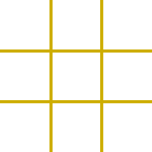

# Project 0

TIC TAC TOE
--------------------------------------


Tic Tac Toe is a simple yet fun game to be played between two players.

This game is the modern day ***Tic Tac Toe***. It has got *fancy* icons to juggle with.

[Play the traditional Paper Pencil Game in an absolutely attractive new way!](https://rashidabengali.github.io/tic-tac-toe/)

## Game Format

There are two levels in the game *Easy* & *Hard*.

### Easy Cheesy ~ 3X3 Board


### Hard Art ~ 4X4 Board


---------------------------------------
Next Step
----------------------------------------

Each of the Levels have two ***Types*** of *Game Rounds*:
1. Single Round
1. Tournament

On **Single Round** selection, one round of game can be played between the two players and the Results will be displayed right after the game is over.


On **Tournament** selection, the players will be asked through a ***PROMPT Message*** how many rounds would they like to play with each other.


Accordingly, a tabular format of score will be displayed throughout the tournament for the players to track their scores.


Once all the rounds are played the *Tournament Winner* will be disclosed


## Technical Terms
I gave my Game's **HTML** page some basic **CSS** styling with a couple of creative animations and hover effects.

I have used the **Javascript** programming language to build game logic and with **jQuery** manipulated the DOM to display scores, results and much more.

##### The following are the primary functions that have been created and called in order to run the game:

`chooseLevel()`
- Player can choose the *Game Level* and the *Type of Rounds* the player is interested in

`playGame()`
- Gets executed when **3x3** board boxes are clicked for either *Single Round* or *Tournament* and the results are rendered on the screen

`playGameHard()`
- Gets executed when **4x4** board boxes are clicked for either *Single Round* or *Tournament* and the results are rendered on the screen

`resetGame()`
- Player can hit the reset button to start a *New Game*

### Acknowledgement
***Special thanks*** to *Yianni* & *Joel* for helping out with instant solutions every time I was stuck with a problem

### Future Features ###
* Player will be able to choose if he wants to play with the computer or with a friend online
* Player will get the facility to choose from a range of fancy icons

*Now, go back and click on the link and do the following:*

```
const enjoyGame = function () {
  alert('Fun Unlimited!');
};

enjoyGame();
```
